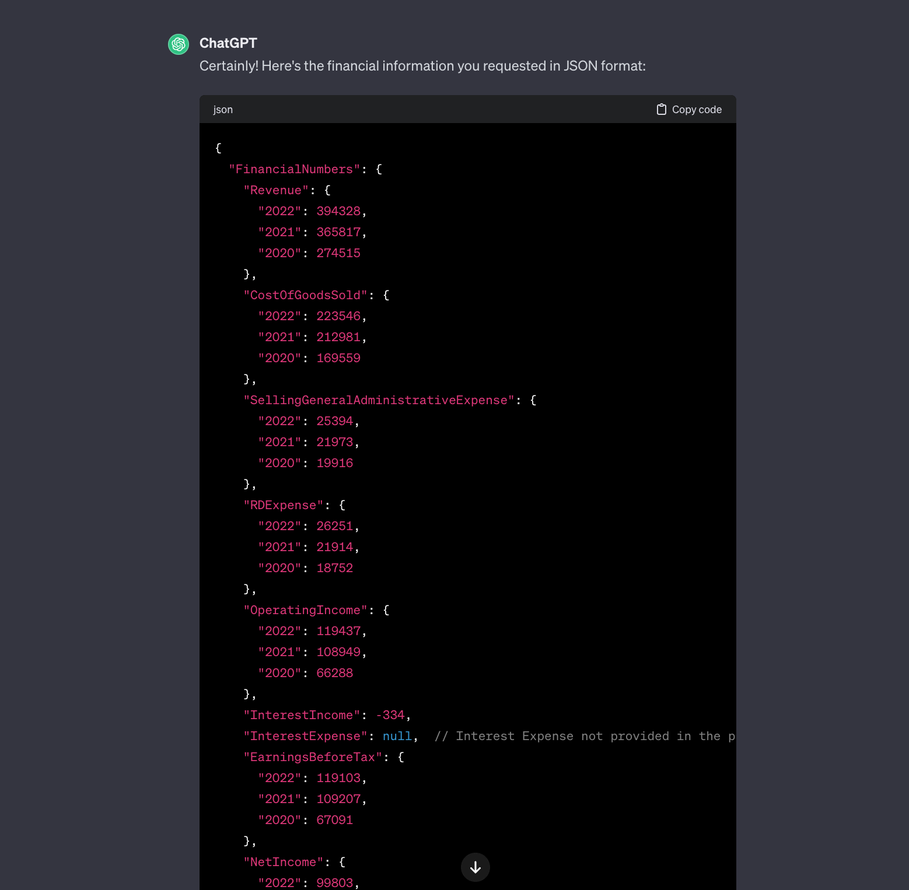
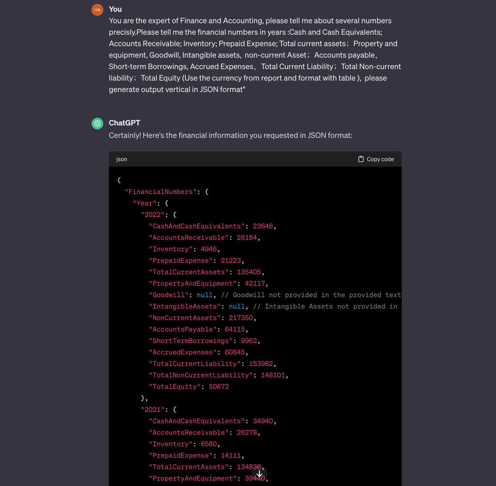

# BankerGPT

A modern application embedded with the ChatGPT API that is built for real-time data scraping, cleaning, integration, and analysis.

## Open Terminal
- on macOS, go to the `Applications` folder --> `Utilities` folder --> open `Terminal`
- on Linux, open `Terminal`

## Install
- You can git clone or directly download the whole file as a .zip file, and unzip it. 
- Open Terminal, go to the folder where you download these files, default in `/Users/USERNAME/`, and you might want to run `cd Downloads/BankerGPT/`, and run the following commends
- Install dependencies on Terminal via `pip install -r requirements.txt` or on macOS run `pip3 install -r requirements.txt`
- Before starting, it's recommended to create a new virtual environment using Python 3.8. We recommend [installing](https://docs.anaconda.com/anaconda/install/index.html) and [using Anaconda](https://conda.io/projects/conda/en/latest/user-guide/tasks/manage-environments.html#creating-an-environment-with-commands) for this.

## Configuration
- in the `config.json` file, you can config all the parameters
  - `start_year XXXX`: the year range to start from (default is 2021).
  - `end_year YYYY`: the year range to end to (default is 2021).
  - `quarters`: the quarters that you want to download filings from (List).  Default value is: `[1, 2, 3, 4]`
  - `cik_tickers`: list or path of file containing CIKs or Tickers. e.g. `[789019, "1018724", "AAPL", "TWTR"]`
  - `user_agent`: the User-agent (name/email) that will be declared to SEC EDGAR.
  - `items_to_extract`: a list with the certain item sections to extract.  
      e.g. `['8']` to extract 'Financial Statements' section items.<be>

## SEC Crawler
- in the Terminal, you can run `python3 1.sec_crawler.py` to execute the crawler in the configuration. 

## Data Extractor
- in the Terminal, you can run `python3 2.data_extractor.py` to execute the data cleaner and data extractor. 

## BankerGPT
- Add you OpenAI key in the file `gpt_key.txt` and replace with everything
- in the Terminal, you can run `python3 3.run_bankergpt.py` to execute the BankerGPT function

## Income Statement Prompt 1 Examples

- "You are the expert of Finance and Accounting, please tell me about several numbers precisly.Please tell me the financial numbers in this year: Revenue；Cost of Goods Sold；Selling, general and administrative Expense；R&D Expense； Operating Income； Interest Income； Interest Expense； Earnings Before Tax；Net Income (Use the currency from report and format with table ), please generate output vertical in JSON format"

## Balance sheet Prompt 2 Examples
- "You are the expert of Finance and Accounting, please tell me about several numbers precisly.Please tell me the financial numbers in 2022:Cash and Cash Equivalents; Accounts Receivable; Inventory; Prepaid Expense; Total current assets；Property and equipment, Goodwill, Intangible assets, Total non-current Asset；Short-term Borrowings, Accounts payable, Accrued Expenses，Total Current Liability；Total Non-current liability,Total Liabilities；Total Equity"
- "You are the expert of Finance and Accounting, please tell me about several numbers precisly.Please tell me the financial numbers in years :Cash and Cash Equivalents; Accounts Receivable; Inventory; Prepaid Expense; Total current assets；Property and equipment, Goodwill, Intangible assets,  non-current Asset；Accounts payable，Short-term Borrowings, Accrued Expenses，Total Current Liability；Total Non-current liability；Total Equity (Use the currency from report and format with table ),  please generate output vertical in JSON format"

